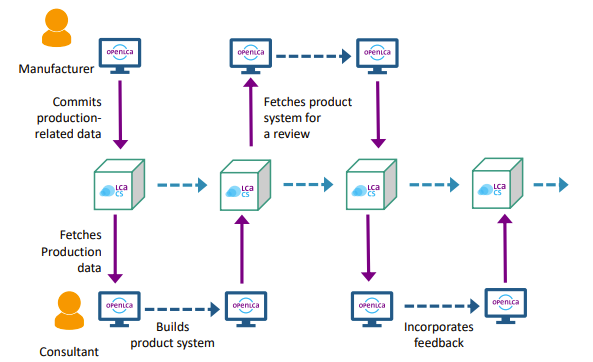

<h2 id="header-1-2">1.2     What are use cases of the LCA Collaboration Server?</h2>

The following are some of the use cases covered by the LCA Collaboration Server: 

<h3 id="header-1-2-1">1.2.1   A team working on the same database/LCA model, and wanting to synchronise their data</h3>

The functionality of the LCA Collaboration Server is largely inspired by modern code sharing and repository software. It introduces industry-proven, state-of-the-art file and model management from IT- to LCA development.

<figure id="Figure 1-1">
	
	<figcaption>The LCA Collaboration Server facilitates LCA modelling in distributed teams</figcaption>
</figure> 

<figure id="Figure 1-2">
	
	<figcaption>Direct collaboration with the study commissioner</figcaption>
</figure>

<h3 id="header-1-2-2">1.2.2   Straightforward sharing of data sets, LCA models and databases</h3> 

Instead of having to first export LCA databases and to then transfer them via e-mail, file hosting applications or data storage devices, LCA models and databases can now easily be shared using the LCA Collaboration Server, which maintains database integrity and enables the tracking of changes. 

<figure id="Figure 1-3">
	
	<figcaption>Hosting options offered for the LCA Collaboration Server</figcaption>
</figure>

<h3 id="header-1-2-3">1.2.3   Building and managing verified public LCA repositories</h3> 

The tracking feature of the LCA Collaboration Server introduces versioning and allows to review contributions to an LCA Collaboration Server repository. One example is the LCA Commons database developed by the USDA and other agencies from the US[^a].

<figure id="Figure 1-4">
	
	<figcaption>Building and managing verified public LCA repositories</figcaption>
</figure>

<h3 id="header-1-2-4">1.2.4   Managing and distributing reference data</h3>

The LCA Collaboration Server allows sharing of reference data within editable and publicly available repositories. 

<figure id="Figure 1-5">
	
	<figcaption>Managing and distributing reference data</figcaption>
</figure>

<h3 id="header-1-2-5">1.2.5   Other use cases</h3>

* A single LCA practitioner working on a database/LCA model from different devices, and wanting to synchronise their data.
* A personal documentation backup system with change control, where one can comment blocks of changes to document their work.

[^a]: <https://www.lcacommons.gov/lca-collaboration/>

