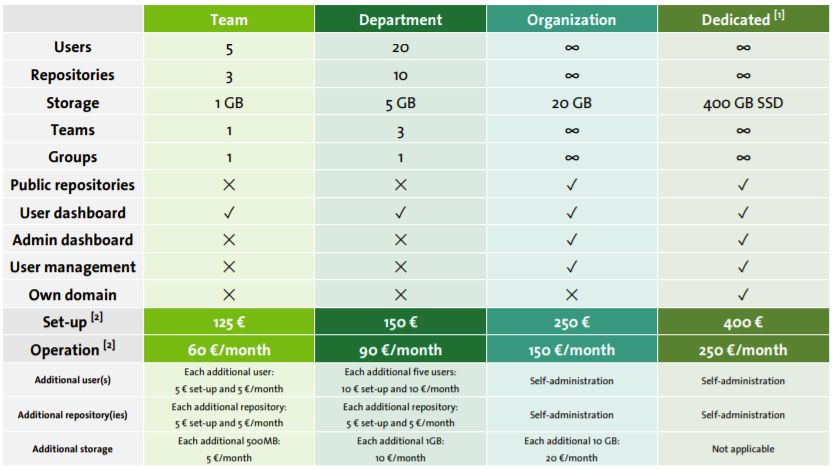

<h2 id="header-2-2">2.2 Hosting and further support</h2>

If the user wants to start using the tool directly without having to install or maintain it, GreenDelta can host the user’s server. The hosting plans are described in this <a href="#Figure 2-1">figure</a>, and it can be purchased in openLCA Nexus: <https://nexus.openlca.org/service/LCA%20Collaboration%20Server%20Hosting>.

For users and administrators of the LCA Collaboration Server who wish to receive guaranteed and prioritised professional support in handling their LCA Collaboration Server, GreenDelta offers paid support via the GreenDelta HelpDesk: <https://nexus.openlca.org/service/openLCA%20Support%20(help%20desk)>. Public user-to-user support is available via <https://ask.openlca.org/>.

<figure id="Figure 2-1">
	
	<figcaption>Hosting options offered for the LCA Collaboration Server <nobr style="font-size: 12px"> 1  </nobr> </figcaption>
</figure>

[^a]: <a href="https://www.openlca.org/wp-content/uploads/2019/11/GreenDelta___Hosting_and_Services.pdf"> <u>https://www.openlca.org/wp-content/uploads/2019/11/GreenDelta___Hosting_and_Services.pdf</u></a> 
