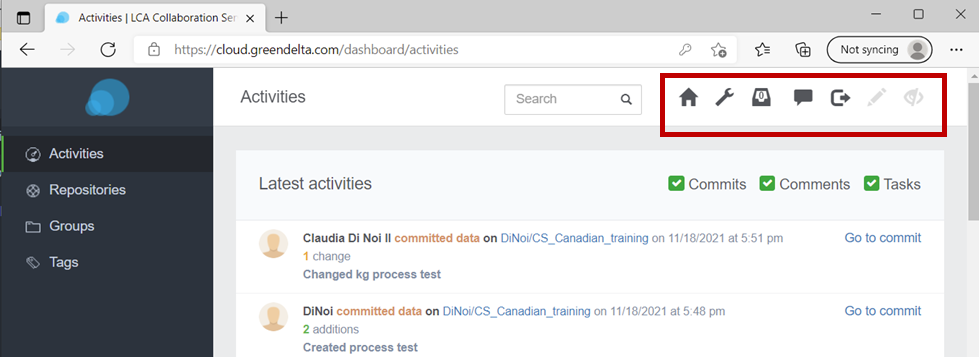
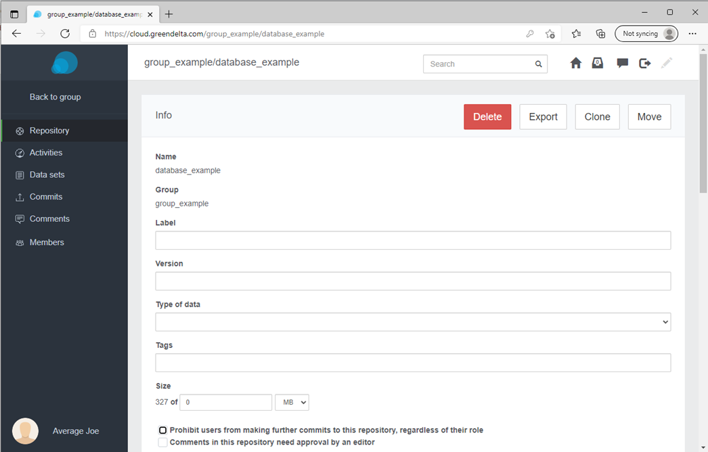

<h2 id="header-2-3">2.3 Getting familiar with the LCA Collaboration Server dashboard</h2>

The <a href="#Figure 2-2">figure</a> below shows the dashboard of the LCA Collaboration Server, this is the first page after login. The icons in the top right corner are explained in this <a href="#Table 2-3-1">table</a>.

<figure id="Figure 2-2">
	
	<figcaption>The LCA Collaboration Server dashboard</figcaption>
</figure>

 

<table id="Table 2-3-1">
    <caption>Features accessible via the LCA Collaboration Server dashboard</caption>
    <tr>
        <th>Icon</th>
        <th>Feature</th>
    </tr>
    <tr>
        <td></td>
        <td>Dashboard, takes user back to home page</td>
    </tr>
    <tr>
        <td></td>
        <td>Admin area (creating users, teams, etc.), only for admin users.</td>
    </tr>
    <tr>
        <td></td>
        <td>Task log, brings back to task overview (optional feature)</td>
    </tr>
    <tr>
        <td></td>
        <td>Log-out</td>
    </tr>
    <tr>
        <td></td>
        <td>Review mode (on/off), enables to add comments on datasets, ready for review</td>
    </tr>
    <tr>
        <td></td>
        <td>Debugging (on/off) , show detailed error stacktraces, only for admin users</td>
    </tr>
</table>

To the left of the dashboard we have a menu: 

<b>Activities tab:</b> displays the latest activities relating to the repositories the user is involved with. It is a log of the commits, tasks and comments.

<b>Repositories tab:</b> is the central place for the repositories[^a]  the user is involved with. Repositories can be managed from here, including creating a new repository, or importing one.

<b>Groups tab:</b> holds the groups that the user is part of. A group is made up of a team of users that works on a number of repositories. For example, if a new member joins an LCA team working with 5 repositories in the LCA Collaboration Server, this new user can join the “group” containing those 5 repositories and have access to all of them at once instead of having to be added to each of the repositories individually. Once a group is entered, the user can add tags, or add and edit the members, depending on their user role (<a href="#header-2-3-3">jump to section</a>). 

<b>Tags:</b> this tab brings the user to the tag cloud (experimental feature). 

Clicking on the user’s name in the bottom left corner of the LCA Collaboration Server dashboard opens the user dashboard, see the following <a href="#Figure 2-3">figure</a>. This gives access to account properties, messaging and notification settings. The dashboard may look slightly different for members with different user rights.

<figure id="Figure 2-3">
	
	<figcaption>User’s dashboard </figcaption>
</figure>

<h3 id="header-2-3-1">2.3.1 Expanding on the repository dashboard</h3>

After clicking on a repository in the repository library (<a href="#Figure 2-2">Figure:</a> The LCA Collaboration Server dashboard), the following dashboard is displayed: 

<figure id="Figure 2-4">
	
	<figcaption>Repository dashboard, of which Average Joe has an “owner” role</figcaption>
</figure>

  

<figure id="Figure 2-repository">
	
</figure>

The first tab, Repository, shows the information of the repository. Further down, there is the “Metadata” section, a great opportunity to document the database. The repository ID is the “groupname/repositoryname”. The repository name can be changed following:

*Move -> Name*

<nobr style="color:red">Caution: </nobr>This will also change the ID of the repository. To change the name without changing the ID, add a “Label”, below “Group” as seen in the above <a href="#Figure 2-4">figure</a>,  to override the repository name, without changing the ID. 
The user can add tags which further classify repositories. They can look for repositories with specific tags through the search function.

 
 

<figure id="Figure 2-activities">
	
</figure>

Activities logs the activities of the repository (i.e. commits or comments to the repository), which are also displayed in the “Activities” of the main menu.

 

<figure id="Figure 2-data-sets">
	
</figure>

The Data sets tab allows one see all of the data in the repository, and to download and export repositories and datasets through the download feature shown in the <a href="#Figure 2-5">figure</a> below. It allows one to download individual versions (commits) of a repository as JSON-LD or ILCD. 

 

<figure id="Figure 2-commits">
	
</figure>

The Commits tab logs all of the commits to the repository.

 

<figure id="Figure 2-comments">
	
</figure>

The Comments tab holds all of the comment history of comments to committed processes.

 

<figure id="Figure 2-tags">
	
</figure>

Adding <i>tags</i> to repositories can be done in <i>Repository tab</i>. Individual datasets can also be tagged, as well as full repositories.

 

<figure id="Figure 2-members">
	
</figure>

The Members tab holds a record of both the members of the repository, and the members of the repository through a group. Members can be added and deleted here, and the user roles described in a <a href="#header-2-3-3">following subsection</a> can also be changed. 

Furthermore, the “owner” of the repository will be able to see the following managing tools for their repository:

<figure id="Figure 2-delete-export-clone-move">
	
</figure>

More on user roles will be explained in a <a href="#header-2-3-3">following subsection</a>, and these buttons will also be explained in [advanced features](./chapter_4_2.md).

<figure id="Figure 2-5">
	
	<figcaption>Download and export of data sets</figcaption>
</figure>

<h3 id="header-2-3-2">2.3.2 Expanding on the admin area dashboard</h3>

One can access the admin area by clicking on the  icon. The icon can only be seen by data managers, user managers, or server administrators. The regular user cannot see it. From the admin area, one can create, delete or manage repositories, users, groups of repositories and teams of users. In Settings the admin user can configure the Collaboration Server and enable or disable features.

<figure id="Figure 2-6">
	
	<figcaption>Admin area in the LCA Collaboration Server</figcaption>
</figure>

<h3 id="header-2-3-3">2.3.3	Groups and user roles</h3>

The group feature allows one to create working groups to which a repository or several repositories (see below) can be assigned. A working group can be managed by assigning different user roles to its members.[^b] A summary of the differences is displayed in the <a href="#Table 2-3-2">table below</a>.

<table id="Table 2-3-2">
    <caption>User Rights</caption>
    <tr>
        <th>Rights</th>
        <th>Reader</th>
        <th>Contributor</th>
        <th>Reviewer</th>
        <th>Editor</th>
        <th>Owner</th>
    </tr>
    <tr>
        <td>Read repositories and fetch contents</td>
        <td>x</td>
        <td>x</td>
        <td>x</td>
        <td>x</td>
        <td>x</td>        
    </tr>
    <tr>
        <td>Commit data to repositories</td>
        <td></td>
        <td>x</td>
        <td>x</td>
        <td>x</td>
        <td>x</td>
    </tr>
    <tr>
        <td>Comment specific fields of data sets</td>
        <td></td>
        <td></td>
        <td>x</td>
        <td>x</td>
        <td>x</td>
    </tr>
    <tr>
        <td>Review comments</td>
        <td></td>
        <td></td>
        <td>x</td>
        <td>x</td>
        <td>x</td>
    </tr>
    <tr>
        <td>Manage comments</td>
        <td></td>
        <td></td>
        <td></td>
        <td>x</td>
        <td>x</td>
    </tr>
    <tr>
        <td>Manage reviews</td>
        <td></td>
        <td></td>
        <td></td>
        <td>x</td>
        <td>x</td>
    </tr>
    <tr>
        <td>Create repositories</td>
        <td></td>
        <td></td>
        <td></td>
        <td></td>
        <td>x</td>
    </tr>
    <tr>
        <td>Edit repository members</td>
        <td></td>
        <td></td>
        <td></td>
        <td></td>
        <td>x</td>
    </tr>
    <tr>
        <td>Adjust settings</td>
        <td></td>
        <td></td>
        <td></td>
        <td></td>
        <td>x</td>
    </tr>
    <tr>
        <td>Move repositories</td>
        <td></td>
        <td></td>
        <td></td>
        <td></td>
        <td>x</td>
    </tr>
    <tr>
        <td>Delete repositories</td>
        <td></td>
        <td></td>
        <td></td>
        <td></td>
        <td>x</td>
    </tr>
   <tr>
        <td>Generate change log</td>
        <td></td>
        <td></td>
        <td></td>
        <td></td>
        <td>x</td>
    </tr>
</table>
 

[^a]: A repository is the equivalent to a database in openLCA and consists of grouped data sets (projects, product systems, processes, flows, indicators and parameters and background data). Basically, a repository mirrors the local openLCA databases of the working group’s users.

[^b]: Data manager (administrate libraries) and user manager (create users and teams) are other additional roles.