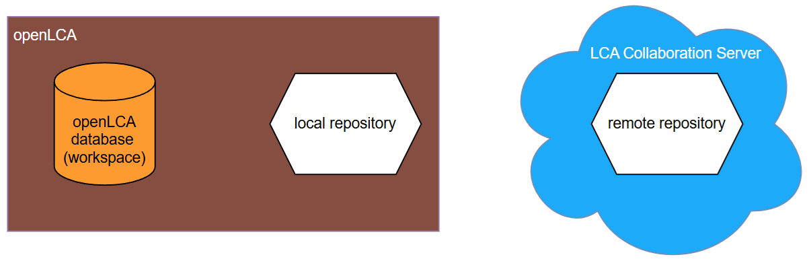
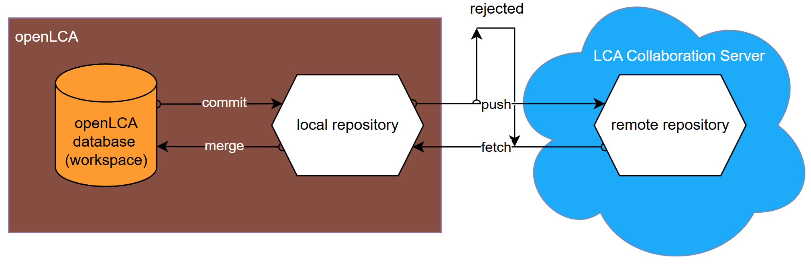
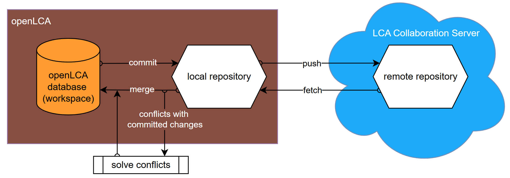
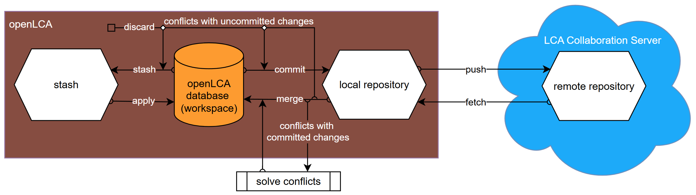

<h2 id="header-3-1">3.1 - The underlying workflow explained</h2>

<h3>Connecting a local openLCA database to a repository</h3>

When you connect your local openLCA database to a repository, such as one hosted on an LCA Collaboration Server (referred to as the "remote repository"), a clone of the remote repository is copied to your local disk, creating a "local repository." Your local openLCA database serves as the "workspace."

<h3>Synchronizing data with the LCA Collaboration Server</h3>

After making changes in your local openLCA database, you must commit these changes to your local repository. To share these changes with others, you need to push them to the remote repository. Similarly, to incorporate changes made by others, you must first fetch the latest data from the remote repository into your local repository and then merge it into your openLCA database.

<h3>Handling changes from the LCA Collaboration Server</h3>

If new commits exist in the remote repository when you attempt to push your changes, you must first fetch the updates and merge them into your workspace. The pull command combines both actions—fetching and merging—into a single step. Once the merge is complete, you can proceed with pushing your changes.

<h3>Resolving conflicts between remote and locally committed changes</h3>

If conflicts arise during the merge process between changes from the remote repository and your locally committed changes, you must resolve these conflicts. A conflict occurs when the same dataset is modified in both locations. If you have already committed changes to your local repository before merging remote updates, or if conflicts are not resolved by overwriting local changes, a merge commit is created in your local repository.

<h3> Resolving conflicts between remote and locally uncommitted changes</h3>

If conflicts occur during merging due to locally uncommitted changes, you have several options:
<ol>
    <li>Discard uncommitted changes before merging.</li>
    <li>Commit uncommitted changes to the local repository before merging.</li>
    <li>Stash uncommitted changes (store them temporarily) before merging and apply them back to the openLCA database after merging.</li>
</ol>

By following these steps, you can efficiently manage data synchronization and conflict resolution within an openLCA database connected to a remote repository.
