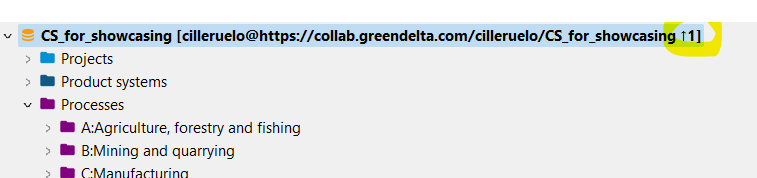

<h2 id="header-3-3">3.3	Adding data to the connected repository</h2>

Right click on the database name in openLCA > Repository > Commit. Alternatively, you can select specific datasets to be uploaded, right click > Repository > Commit. The speed of the push depends on network connection and the size of the database. Note that the database in openLCA should be connected to the LCA Collaboration Server [section 3.2](./chapter_3_2.md).

The user must always include a commit message to be able to commit data to the repository. 

As shown in the figure below, there are two options to commit the data. Commit and Push will directly upload the selected data in the repository on the server. Commit will store the commit locally and is pending to be <i>pushed</i>.

<figure id="Figure 3-5">
	
    <figcaption>There are two options to commit data to the repository</figcaption>
</figure>
 
<figure id="Figure 3-6">
	
    <figcaption>an arrow will show when there is a commit pending to be pushed (arrow upwards), or a fetch pending to be merged (arrow downwards)</figcaption>
</figure>
 
Uploading the whole database for the first time (first commit) may take around 15 minutes. It is also possible to select only specific data sets for a commit via right-click + CTRL.

<b>Hint I</b>: To maintain transparency and clarity, it is recommended to regularly commit small data sets rather than to occasionally commit large data sets. This helps team members to trace and understand changes, guarantees clean versioning of a repository and helps to avoid pitfalls ([see section 3.7](./chapter_3_7.md)).