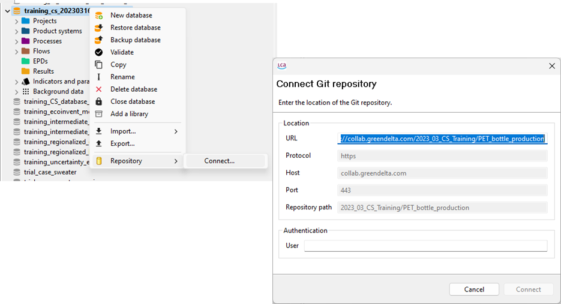
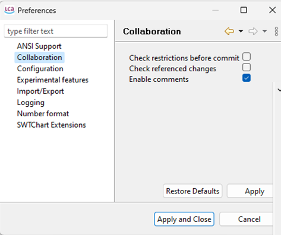
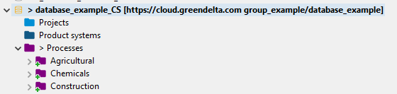
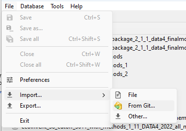

<h2 id="header-3-3">3.3	How to connect and disconnect your local openLCA to the LCA Collaboration Server</h2>

<h3>Connecting openLCA to the LCA Collaboration Server</h3>

The user must have openLCA[^a] version 2.0 installed on their computer, and a server holding the LCA Collaboration Server assigned. 

<ol>
    <li>Right clicking on the database in <i>openLCA > Repository > Connect …</i></li>
    <li>Paste the URL ( e.g. https://collab.openlca.org/cilleruelo/new_repository) of your repository and insert your user details (you will later be asked for the password)</li>
</ol>

To access collaboration server settings in openLCA, click 

<i>file > settings > collaboration</i>

<figure id="Figure 3-1">
	
    <figcaption>Steps to connect a database in openLCA with a repository in the LCA Collaboration Server</figcaption>
</figure>

 

<figure id="Figure 3-2">
	
    <figcaption>options for the LCA Collaboration Server can be accessed through <i>file > preferences > collaboration</i></figcaption>
</figure> 

<figure id="Figure 3-3">
	
    <figcaption>Connected database</figcaption>
</figure>

To disconnect from a repository right-click on the respective database and select <i>repository > disconnect</i>.

<h3 id="header-3-2-1">Connecting to an existing repository through Git</h3>

If you want to start with an existing repository you can use “Import/From git…”. This is like “creating a new empty database”, “connect” and “pull” in once.

<figure id="Figure 3-4">
	
    <figcaption>connecting to a Git repository</figcaption>
</figure>

[^a]: To download openLCA visit: <a href="https://www.openlca.org/download/"> <u>https://www.openlca.org/download/</u></a> 
