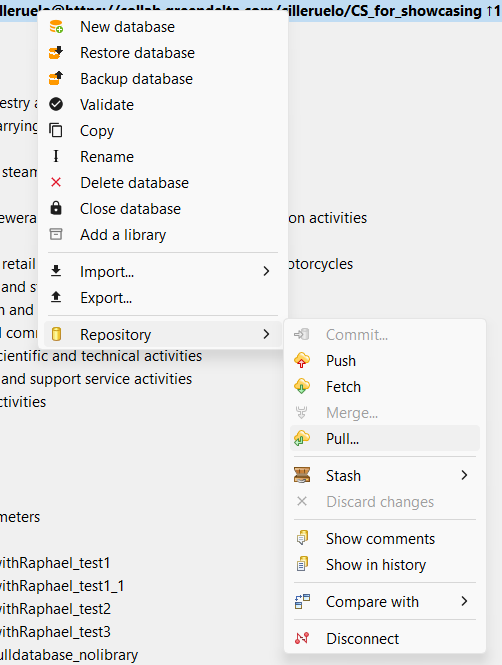

<h2 id="header-3-5">3.5	Getting data sets from the repository </h2>

There are two options to fetch data sets from a repository. First make sure you’re connected to the repository. 

<ol>
<li>Right-click on the database and select repository > pull.</li>
<li>Right-click on the database and select repository > fetch. You will later have to <i>merge</i>.</li>
</ol>

<figure id="Figure 3-7">
	
    <figcaption>Fetching a repository from the LCA Collaboration Server in openLCA</figcaption>
</figure>

In order to see the datasets taken from the repository, you can check the commit history [see section 4.1](./chapter_4_1.md).

Hint: To maintain transparency and clarity, it is recommended to get data from the repository regularly. This enables the user to trace and understand changes easily and helps to avoid conflicts [see section 3.8](./chapter_3_8.md).
