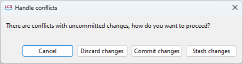
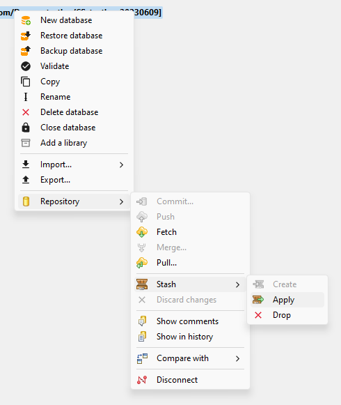
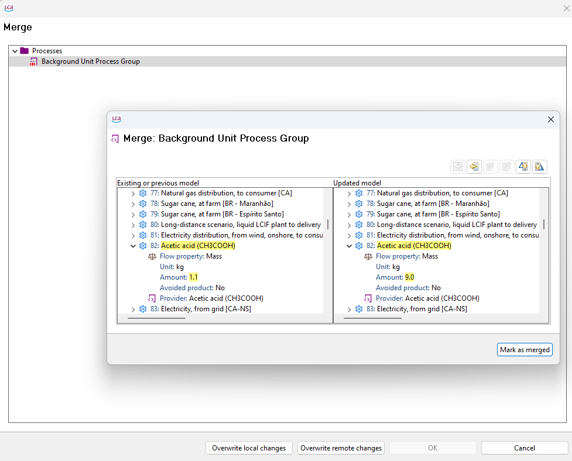

<h2 id="header-3-6">3.6	Conflicts</h2>

Conflicts may occur if two or more users work on the same database item or interlinked database items. This is best avoided by directly coordinating work within your team as well as performing regular pulls and to push regularly. The diff utility ([under section 4.2](./chapter_4_2.md)) assists in detecting commits by other users and identifying potential conflicts ([see section 3.7](./chapter_3_7.md)).

If a conflict exists, the user will be notified by the Collaboration Server like shown in the <a href="#Figure 3-9">figure below</a>.
 
<figure id="Figure 3-9">
	
    <figcaption>This window appears when there is a conflict, allowing for several action options</figcaption>
</figure>

Stash changes gets the external changes, puts them in the local database, and puts the local changes in a “box”. The user can access this box, or stash, like shown in <a href="#Figure 3-10">figure below</a>.

<figure id="Figure 3-10">
	
    <figcaption>Access the stash</figcaption>
</figure>

After clicking “Apply“, the Merge dialogue (<a href="#Figure 3-11">figure below</a>) will open, where you can see the differences between your local database and the repository, and decide what to do.

<figure id="Figure 3-11">
	
    <figcaption>Merge dialogue helps resolve conflicts</figcaption>
</figure>