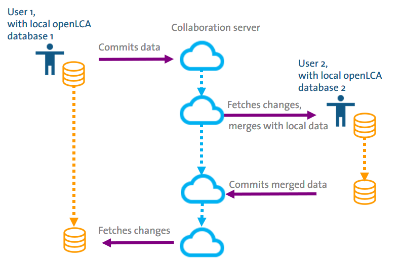

<h2 id="header-3-6">3.6	The workflow is always linear</h2>

To understand how exactly the LCA Collaboration Server works, it is important to note that the workflow of committing and fetching is always linear. In practice, this means that users cannot commit data sets to the server indiscriminately. In fact, before pushing to the server, the user has to fetch the current state of the repository from the LCA Collaboration Server and merge it into his database <a href="#Figure 3-8">(figure below)</a>.

Still, two or more users can work on the same shared database at the same time. A conflict may arise if both users change the same dataset in the database ([see section 3.7](./chapter_3_7.md)).
 
<figure id="Figure 3-8">
	
    <figcaption>The workflow of a commit is always linear</figcaption>
</figure>
