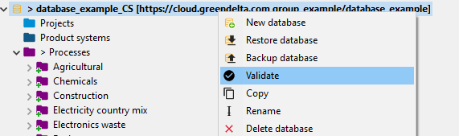
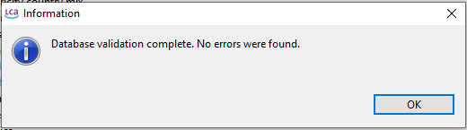

<h2 id="header-3-8">3.8	Pitfalls</h2>

Ultimately, users are responsible for the integrity of a repository and must understand that a repository is a complex interlinked system. Interlinkages must be respected, and a commit must always contain all interlinkages to any of the changes in the data set.

<h3 id="header-3-8-1">3.8.1	Validating databases</h3>

To assure that all interlinkages within a database are set correctly, databases should be validated regularly. To do so, right-click on a database and select validate (shown in figures below). A validation identifies whether all linkages within a database are working.

If a validation fails, missing interlinkages should be fixed before performing a commit. If a user is unable to validate a database it is recommended to discard changes, fetch the repository again and to redo modelling steps. A user may fail to validate a database if corrupt data sets (which were committed by other users) were fetched from the repository. 

<figure id="Figure 3-12">
	
    <figcaption>'Validate' allows one to check whether all linkages within a database are working</figcaption>
</figure>

<figure id="Figure 3-13">
	
    <figcaption>Success message when validating the database</figcaption>
</figure> 

<h3 id="header-3-8-2">3.8.2	Example 1 - Missing interlinked flow</h3>

A user adds a flow to a local database and uses the flow as an input for a process. The user commits the new process to the repository but does not commit the underlying flow. The linked flow is missing in the repository and corrupts the database for other users.

<h3 id="header-3-8-3">3.8.3	Example 2 - Modified flow property</h3>

A user changes the flow property of an existing flow in a local openLCA database and uses the flow with the updated property in a process. The user commits the process to the repository but not the flow with the modified flow property. The modification of the flow is missing in the repository and corrupts the data set in the repository for other users.

