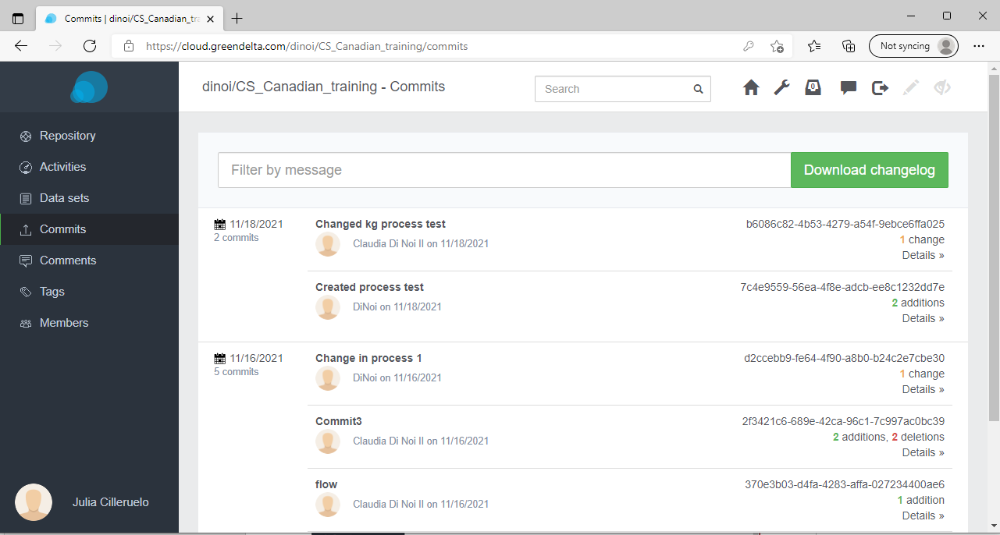
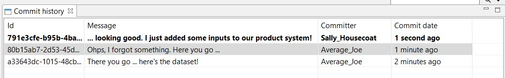
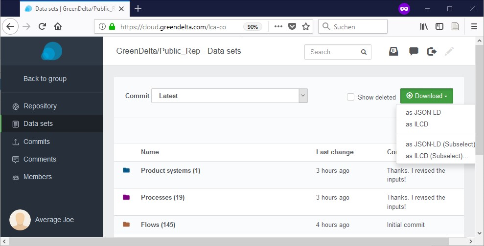

<h2 id="header-4-1">4.1 Basic features</h2>

<h3 id="header-4-1-1">4.1.1 Commit history</h3>

A history of all commits is available in openLCA via right-click on a database <i>Repository > Show in history</i> (<a href="#Figure 4-2">Figure below</a>) and via the LCA Collaboration Server dashboard (<a href="#Figure 4-1">Figure below</a>).

<figure id="Figure 4-1">
	
    <figcaption>History of commits in the LCA Collaboration Server dashboard</figcaption>
</figure>

 

<figure id="Figure 4-2">
	
    <figcaption>History of commits in openLCA</figcaption>
</figure>

<h3 id="header-4-1-2">4.1.2 Download of whole repositories or selected datasets</h3>

The download feature allows to download individual versions (commits) of a repository as <i>JSON-LD</i> or <i>ILCD</i> (<a href="#Figure 4-3">Figure below</a>) files. It is also possible to download individual datasets from the Collaboration Server.

<figure id="Figure 4-3">
	
    <figcaption>Download and export of data sets</figcaption>
</figure> 