

<h2 id="header-4-2">4.2 Advanced features</h2>

<h3 id="header-4-2-1">4.2.1 Managing repositories</h3>

The “owner” of the repository will be able to see a set of buttons that can edit the entire repository.

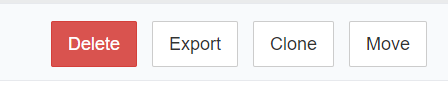

 To delete the repository.

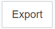 To export the repository as a zip file. The data format is specific to the LCA CS. This file can be uploaded again to the LCA CS. 

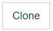 To make a copy of the repository in the LCA CS. It clones the entire repository's content, including metadata. One can select where you want to clone it to. You can clone the repository in the current state or select a previous commit (the repository will be cloned up to that commit). This becomes handy when updating the database whilst maintaining the older version.

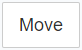 To change the name of a repository. Caution should be taken here, as this will also change the reference ID or repository path which will cause further problems with the connections to this repository. Every user should update the repository path.

<h3 id="header-4-2-2">4.2.2 Restoring previous versions of a dataset</h3>

There is no direct option to restore previous versions of a repository. However, a workaround does exist. Right click on a database in openLCA and select <i>Repository > compare with > HEAD revision</i>. Afterwards, right-click and select overwrite with local changes and commit. 

<h3 id="header-4-2-3">4.2.3	Notifications</h3>

Notification settings can be adjusted upon clicking on the user’s name in the bottom left corner of the LCA Collaboration Server dashboard. Afterwards, select Notifications from the entries in the menu on the left side (<a href="#Figure 4-4">Figure below</a>).

<figure id="Figure 4-4">
	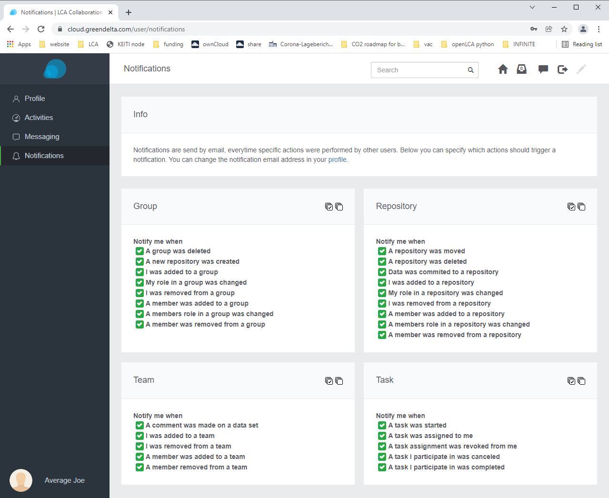
    <figcaption>Notifications settings</figcaption>
</figure>

<h3 id="header-4-2-4">4.2.4	Messaging</h3>

A messaging feature for conversations among team members is available via the speech bubble in the top right-corner of the LCA Collaboration Server user dashboard (<a href="#Figure 4-5">Figure below</a>). To enable the messaging feature click on your profile settings in the bottom-left corner of the LCA Collaboration Server dashboard and select Messaging in the left sidebar.

<figure id="Figure 4-5">
	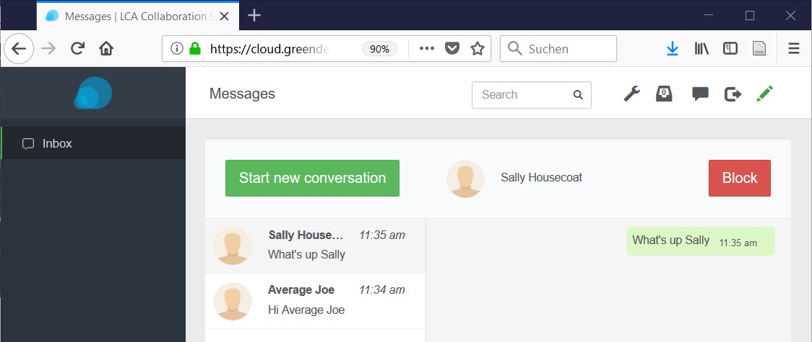
    <figcaption>The messaging feature can be accessed via the speech bubble in the top right corner</figcaption>
</figure>

<h3 id="header-4-2-5">4.2.5	Comments and review mode</h3>

Specific fields of a data set as well as entire data sets as such can be commented. To add comments, click on the pencil in the top-right corner of the LCA CS dashboard. This activates review mode. Once review mode has been activated, speech bubbles show up for each item that is able to be commented (<a href="#Figure 4-6">figure below</a>). Regardless of whether the review mode is active or not, an existing comment is indicated through a green speech bubble (<a href="#Figure 4-6">figure below</a>).

Comments can be released immediately, added as a draft or added for a review by a moderator. An overview of all comments in the LCA Collaboration Server dashboard is available via the left sidebar (<a href="#Figure 4-7">jump to figure</a>). Comments can also be viewed in openLCA. Right-click on the respective database and navigate to <i>repository > show comments</i> (<a href="#Figure 4-8">jump to figure</a>). If an item has been commented, a ’Comments’ tab shows up in the bottom right corner of the item’s tab (<a href="#Figure 4-9">jump to figure</a>).

<figure id="Figure 4-6">
	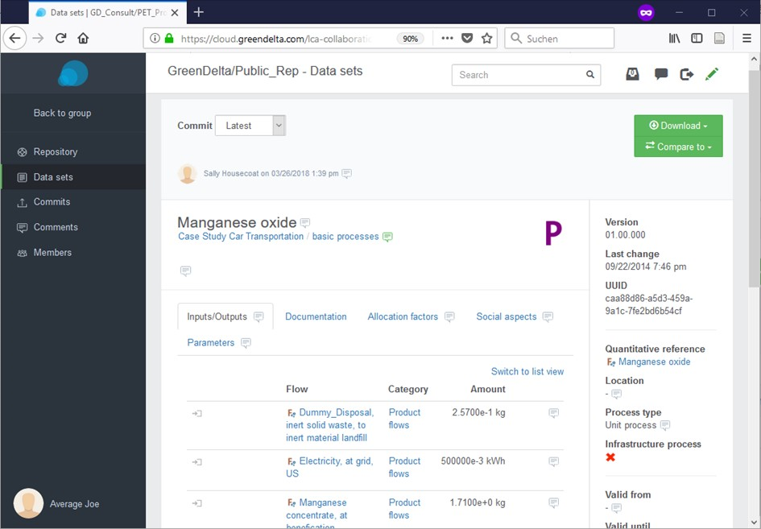
    <figcaption>Upon activating the review mode, comment bubbles can be seen in different locations. Regardless of whether the review mode is activated or not, commented items are indicated through a green speech bubble</figcaption>
</figure>

 

<figure id="Figure 4-7">
	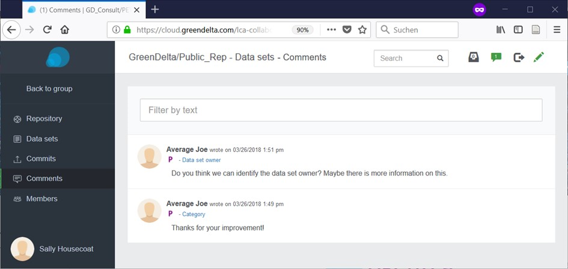
    <figcaption>Comment overview in the LCA Collaboration Server dashboard</figcaption>
</figure>

 

<figure id="Figure 4-8">
	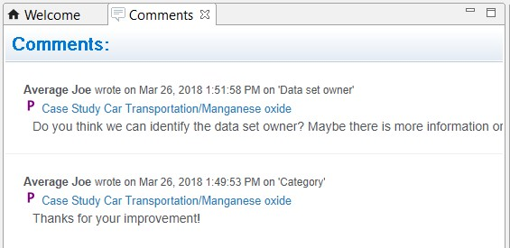
    <figcaption>Comment overview in openLCA</figcaption>
</figure>

<figure id="Figure 4-9">
	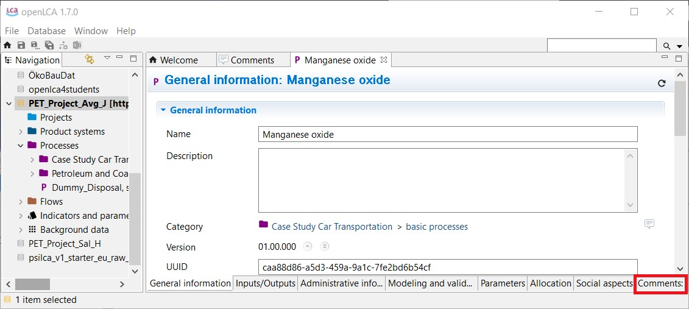
    <figcaption>If an item has been commented, a ’Comments’ tab shows up in the bottom right corner of the item’s tab</figcaption>
</figure>

<h3 id="header-4-2-6">4.2.6	Tasks</h3>

The task system can be accessed via the paper tray symbol in the top-right corner of the LCA Collaboration Server dashboard and allows creating tasks which can be assigned to Reviewers (<a href="#Table 4-2-1">Table below</a>). Proper use of the task system requires at least one user in the team to have Reviewer user rights (<a href="#Table 4-2-1">Table below</a>).

<table id="Table 4-2-1">
    <caption>Features accessible via the LCA Collaboration Server dashboard</caption>
    <tr>
        <th>Status</th>
        <th>Description</th>
    </tr>
    <tr>
        <td>In progress</td>
        <td>Awaiting release or moderation (depending on whether a user is <i>Editor</i> or <i>Reviewer</i>)</td>
    </tr>
    <tr>
        <td>Completed</td>
        <td>Released and/or reviewed</td>
    </tr>
    <tr>
        <td>Cancelled</td>
        <td>No further action is required</td>
    </tr>
</table>

<h3 id="header-4-2-7">4.2.7	Diff utility</h3>

The ‘diff utility’ in openLCA is a data comparison tool to display differences between commits. It compares data sets in the local database with those in the repository of the LCA Collaboration Server. To open the diff utility right-click on a database and select <i>Repository > Show</i> in history. The diff utility supports solving conflicts by identifying differences between the local database and a version of the repository (<a href="#Figure 4-10">figure below</a>).

<figure id="Figure 4-10">
	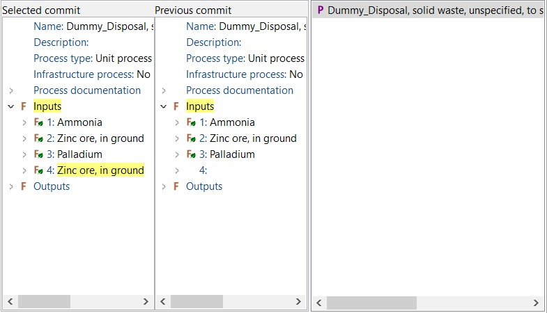
    <figcaption>openLCA’s Diff utility displays differences between the local version of a database and a version of the repository. In the Figure, the flow Zinc ore, in ground has been added to the process Dummy disposal.</figcaption>
</figure>
 