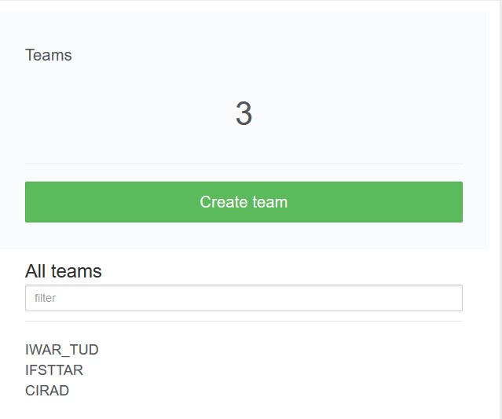

<h2 id="header-4-3">4.3	Expert features</h2>

<h3 id="header-4-3-1">4.3.1	Additional roles</h3>

Additional roles are that of the Data Manager and User Manager. Both can be assigned as such by the Server Administrator.

- Data Manager – A data manger can manage libraries and push data to GLAD[^a]
- User Manager – A user manager can manage users and teams

**Restricted data sets**

These  are protected data sets that require an additional confirmation to commit changes.

**Create users**

Users can be created by accessing the admin area via clicking on the wrench in the top-right corner of the LCA Collaboration Server dashboard.

**Teams**

Individual users can be combined into a team and teams can be added to groups (of repositories). Teams consist of users, and groups contain repositories.  Teams can be added to a repository. Teams are created by accessing the admin area via clicking on the wrench in the top-right corner of the LCA Collaboration Server dashboard (<a href="#Figure 4-11">Figure below</a>).[^b] 

<figure id="Figure 4-11">
	
    <figcaption>Teams are created by accessing the admin area via clicking on the wrench in the top-right corner of the LCA Collaboration Server dashboard</figcaption>
</figure>

[^a]: Global LCA Data Access network (<a href="https://www.unep.org/explore-topics/resource-efficiency/what-we-do/life-cycle-initiative/global-lca-data-access-network"> <u>http://unep-glad.71.ecedi.fr/</u></a>). Feature developed for the USDA.  

[^b]: Please note that only admins can create teams
