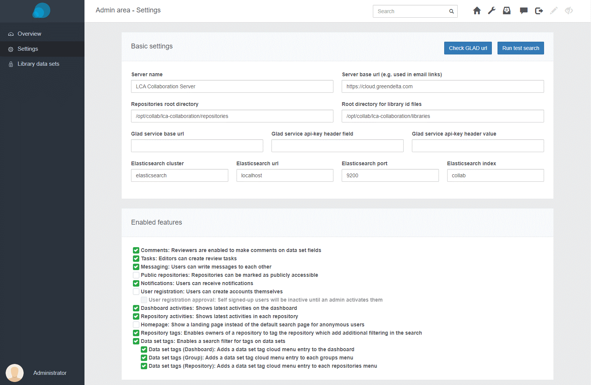
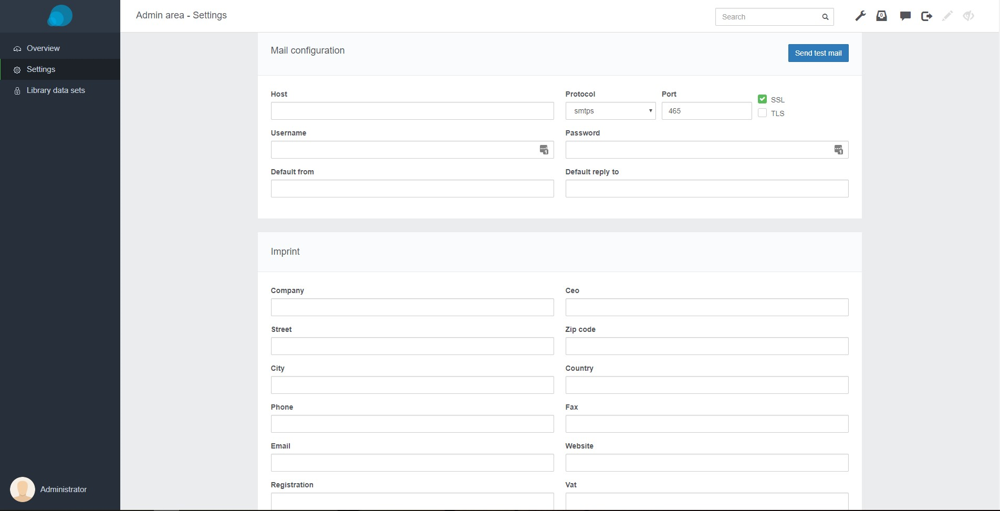

<h2 id="header-8-3">8.3	Configuration </h2>
We have prepared a configuration guide on openLCA.org - <a href="https://www.openlca.org/lca-collaboration-server-2-configuration-guide/"> Configuration Guide</a>. Also you can find some settings described below.

<b>Changing settings in the web application</b>

<figure id="Figure A-1">
	
    <figcaption>Admin area basic settings and enabled features</figcaption>
</figure>

<figure id="Figure A-2">
	
    <figcaption>Admin area mail configuration and imprint</figcaption>
</figure>

<h2 id="header-8-3-1">8.3.1 Basic Settings </h2>
 <b>Servername:</b> The Server name, used for two-factor-authentication (optional)  
 <b>Server base url:</b> The base url used when linking pages in the notification emails 
 <b>Repositories root directory:</b> In this directory, the repository data sets will be stored, this will need extended disk space, depending on the amount of data sets committed. 
 <b>Root directory for library id files:</b> In this directory, configured library data set ref ids will be stored 
 <b>Glad service base url:</b> The base url to an external GLAD service 
 <b>Glad service api key:</b> To push data set descriptors to the GLAD service, an API key is required, which can be set here. 
 <b>Elasticsearch cluster:</b> The cluster name of your elasticsearch installation (default: elasticsearch) 
 <b>Elasticsearch server url:</b> The host address of the elasticsearch installation (default: localhost) 
 <b>Elasticsearch index name:</b> The name of the elasicsearch index used for this collaboration server instance (default: lca- collaboration) 

<h2 id="header-8-3-2">8.3.2	Enabled features </h2>
Some of the collaboration server’s advanced features can be disabled, including: Comments, Tasks, Messaging, Public repositories, Notifications, Activities and Tags (<a href="#Figure A-1">jump to figure above</a>).

<h2 id="header-8-3-3">8.3.3	Mail Configuration </h2>
To be able to use notifications, you need to configure an email account to send from. You can use an existing smpt email account (<a href="#Figure A-2">jump to figure above</a>).
