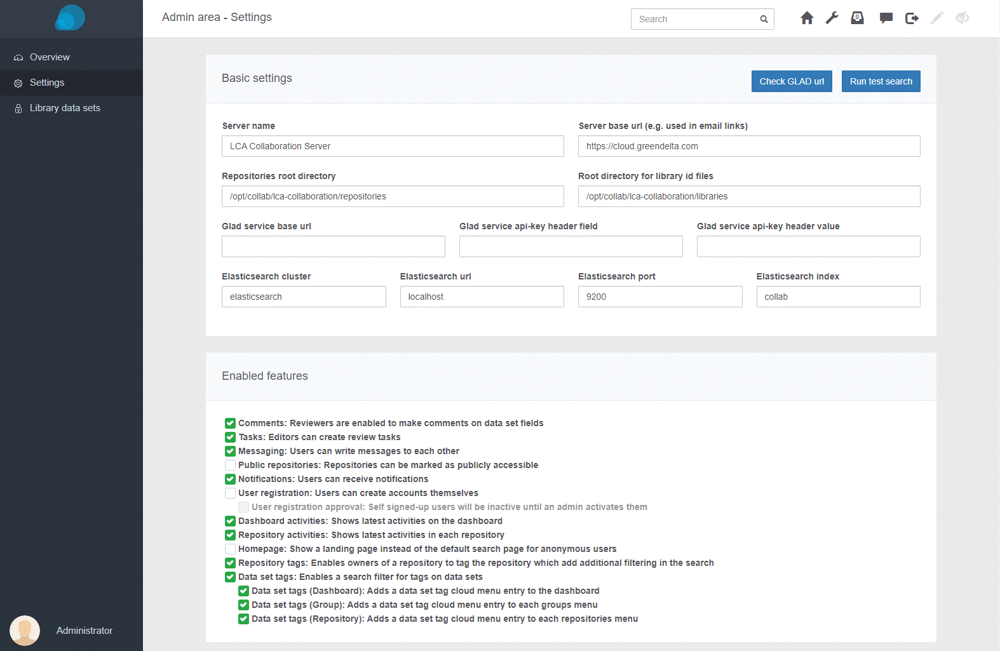
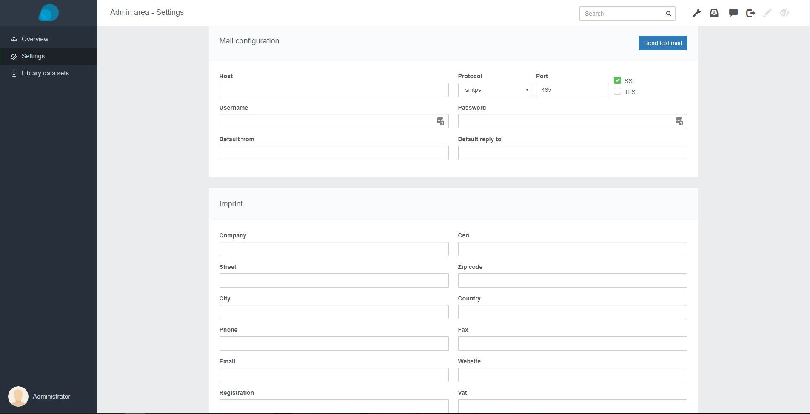

<h2 id="header-8-3">8.3	Configuration </h2>
We have prepared a configuration guide on openLCA.org - <a href="https://www.openlca.org/lca-collaboration-server-2-configuration-guide/"> Configuration Guide</a>. Also you can find some settings described below.

<b>Changing settings in the web application</b>

<figure id="Figure A-1">
	
    <figcaption>Admin area basic settings and enabled features</figcaption>
</figure>

<figure id="Figure A-2">
	
    <figcaption>Admin area mail configuration and imprint</figcaption>
</figure>

<h2 id="header-8-3-1">8.3.1 Basic Settings </h2>
 <b>Servername:</b> The Server name, used for two-factor-authentication (optional)  
 <b>Server base url:</b> The base url used when linking pages in the notification emails 
 <b>Repositories root directory:</b> In this directory, the repository data sets will be stored, this will need extended disk space, depending on the amount of data sets committed. 
 <b>Root directory for library id files:</b> In this directory, configured library data set ref ids will be stored 
 <b>Glad service base url:</b> The base url to an external GLAD service 
 <b>Glad service api key:</b> To push data set descriptors to the GLAD service, an API key is required, which can be set here. 
 <b>Elasticsearch cluster:</b> The cluster name of your elasticsearch installation (default: elasticsearch) 
 <b>Elasticsearch server url:</b> The host address of the elasticsearch installation (default: localhost) 
 <b>Elasticsearch index name:</b> The name of the elasicsearch index used for this collaboration server instance (default: lca- collaboration) 
 

Default values for each setting can be specified programmatically before starting the application, see the list at the end of the page

<h2 id="header-8-3-2">8.3.2	Enabled features </h2>
Some of the collaboration server’s advanced features can be disabled, including: Comments, Tasks, Messaging, Public repositories, Notifications, Activities and Tags (<a href="#Figure A-1">jump to figure above</a>).

<h2 id="header-8-3-3">8.3.3	Mail Configuration </h2>
To be able to use notifications, you need to configure an email account to send from. You can use an existing smpt email account (<a href="#Figure A-2">jump to figure above</a>).

<h2 id="header-8-3-4">8.3.4 List of settings for setting default values in application.properties </h2>

The following settings can be set in WEB-INF/classes/application.properties after which a restart is required. They can afterwards still be changed in the UI

cs.settings.default-values.SERVER_SETTING.MESSAGING_ENABLED={Boolean} 
cs.settings.default-values.SERVER_SETTING.TASKS_ENABLED={Boolean} 
cs.settings.default-values.SERVER_SETTING.COMMENTS_ENABLED={Boolean} 
cs.settings.default-values.SERVER_SETTING.RELEASES_ENABLED={Boolean} 
cs.settings.default-values.SERVER_SETTING.NOTIFICATIONS_ENABLED={Boolean} 
cs.settings.default-values.SERVER_SETTING.USER_REGISTRATION_ENABLED={Boolean} 
cs.settings.default-values.SERVER_SETTING.USER_REGISTRATION_APPROVAL_ENABLED={Boolean} 
cs.settings.default-values.SERVER_SETTING.CHANGE_LOG_ENABLED={Boolean} 
cs.settings.default-values.SERVER_SETTING.DASHBOARD_ACTIVITIES_ENABLED={Boolean} 
cs.settings.default-values.SERVER_SETTING.REPOSITORY_ACTIVITIES_ENABLED={Boolean} 
cs.settings.default-values.SERVER_SETTING.HOMEPAGE_ENABLED={Boolean} 
cs.settings.default-values.SERVER_SETTING.SEARCH_ENABLED={Boolean} 
cs.settings.default-values.SERVER_SETTING.USAGE_SEARCH_ENABLED={Boolean} 
cs.settings.default-values.SERVER_SETTING.REPOSITORY_TAGS_ENABLED={Boolean} 
cs.settings.default-values.SERVER_SETTING.DATASET_TAGS_ENABLED={Boolean} 
cs.settings.default-values.SERVER_SETTING.DATASET_TAGS_ON_DASHBOARD_ENABLED={Boolean} 
cs.settings.default-values.SERVER_SETTING.DATASET_TAGS_ON_GROUPS_ENABLED={Boolean} 
cs.settings.default-values.SERVER_SETTING.DATASET_TAGS_ON_REPOSITORIES_ENABLED={Boolean} 
cs.settings.default-values.SERVER_SETTING.DOCKER_INSTALLATION={Boolean} 
cs.settings.default-values.SERVER_SETTING.SERVER_NAME={String} 
cs.settings.default-values.SERVER_SETTING.SERVER_URL={String} 
cs.settings.default-values.SERVER_SETTING.REPOSITORY_PATH={String} 
cs.settings.default-values.SERVER_SETTING.LIBRARY_PATH={String} 
cs.settings.default-values.SERVER_SETTING.GLAD_URL={String} 
cs.settings.default-values.SERVER_SETTING.GLAD_API_KEY={String} 
cs.settings.default-values.SERVER_SETTING.GLAD_DATAPROVIDER={String} 
cs.settings.default-values.SERVER_SETTING.HOME_TITLE={String} 
cs.settings.default-values.SERVER_SETTING.HOME_TEXT={String} 
cs.settings.default-values.SERVER_SETTING.MAINTENANCE_MODE={Boolean} 
cs.settings.default-values.SERVER_SETTING.MAINTENANCE_MESSAGE={String} 
cs.settings.default-values.SERVER_SETTING.ANNOUNCEMENT_ID={String} 
cs.settings.default-values.SERVER_SETTING.ANNOUNCEMENT_MESSAGE={String} 
cs.settings.default-values.SERVER_SETTING.LICENSE_AGREEMENT_TEXT={String} 
cs.settings.default-values.SEARCH_SETTING.SCHEMA={String} 
cs.settings.default-values.SEARCH_SETTING.HOST={String} 
cs.settings.default-values.SEARCH_SETTING.PORT={Integer} 
cs.settings.default-values.SEARCH_INDEX.PRIVATE={String} 
cs.settings.default-values.SEARCH_INDEX.PUBLIC={String} 
cs.settings.default-values.SEARCH_INDEX.PRIVATE_USAGE={String} 
cs.settings.default-values.SEARCH_INDEX.PUBLIC_USAGE={String} 
cs.settings.default-values.MAIL_SETTING.USER={String} 
cs.settings.default-values.MAIL_SETTING.PASS={String} 
cs.settings.default-values.MAIL_SETTING.PROTO={String} 
cs.settings.default-values.MAIL_SETTING.HOST={String} 
cs.settings.default-values.MAIL_SETTING.PORT={Integer} 
cs.settings.default-values.MAIL_SETTING.SSL={Boolean} 
cs.settings.default-values.MAIL_SETTING.TLS={Boolean} 
cs.settings.default-values.MAIL_SETTING.DEFAULT_FROM={String} 
cs.settings.default-values.MAIL_SETTING.DEFAULT_REPLY_TO={String} 
cs.settings.default-values.IMPRINT_SETTING.COMPANY={String} 
cs.settings.default-values.IMPRINT_SETTING.CEO={String} 
cs.settings.default-values.IMPRINT_SETTING.STREET={String} 
cs.settings.default-values.IMPRINT_SETTING.ZIP_CODE={String} 
cs.settings.default-values.IMPRINT_SETTING.CITY={String} 
cs.settings.default-values.IMPRINT_SETTING.COUNTRY={String} 
cs.settings.default-values.IMPRINT_SETTING.PHONE={String} 
cs.settings.default-values.IMPRINT_SETTING.FAX={String} 
cs.settings.default-values.IMPRINT_SETTING.EMAIL={String} 
cs.settings.default-values.IMPRINT_SETTING.WEBSITE={String} 
cs.settings.default-values.IMPRINT_SETTING.REGISTRATION={String} 
cs.settings.default-values.IMPRINT_SETTING.VAT={String} 
